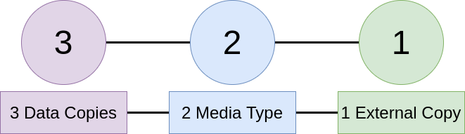

# DynTools : Backup

## Table Of Contents

- [DynTools : Backup](#dyntools--backup)
  - [Table Of Contents](#table-of-contents)
  - [Description](#description)
  - [Documentations](#documentations)
  - [How to Backup](#how-to-backup)
  - [What to Backup](#what-to-backup)
    - [For Linux](#for-linux)
    - [For Windows](#for-windows)
  - [Services](#services)

## Description

**Backup** is a large subject, here is a little documentation of what **services** use and **how** to backup.

## Documentations

- [3..2..1 Backup (FR)](https://www.youtube.com/watch?v=vKw8pGNW94g)

## How to Backup

> First of all, don't forget a big rule : **RAID is NOT Backup**

Why ? **RAID** improve data online but can't **preserve** you from **delete** of data, but a **backup** can do it.

Now what is the Best Practices 3..2..1 ? Here a schema :

Now a little **example** :

- **3 Copies** of your PC images
- On **2 Media** with different type :
  - Your **personal PC**
  - An **external storage disk**
- With **1 external copy** on **Google Drive**

With this you can store your backup correctly.

## What to Backup

You have some data to save :

- Mail
- Games (game saves)
- Softwares (software configurations)
- Documents
- Musics
- Images
- Videos
- Ebooks
- Other medias you have

### For Linux

For Linux you have several data specific to this system to backup :

- **Data at** :
  - $HOME/.*
  - /opt/*
- **Docker Volumes** (/var/lib/docker/volumes/*)

### For Windows

For Windows you have several data specific to this system to backup :

- **Programs Data** :
  - /Users/USER/Appdata/*
  - /ProgramData/*

## Services

There are some backup services, here a simple list of them :

- **Duplicati** : Very good backup service self hosted for server or PC.

There are also some Cloud provider that permit backup :

- **AWS Bucket S3** : Simple to use and little price per GB (high price for transfert !)
- **pCloud** : Great solution with a high price but for life long service !
- **Google Drive** : Good and integrated in any device
